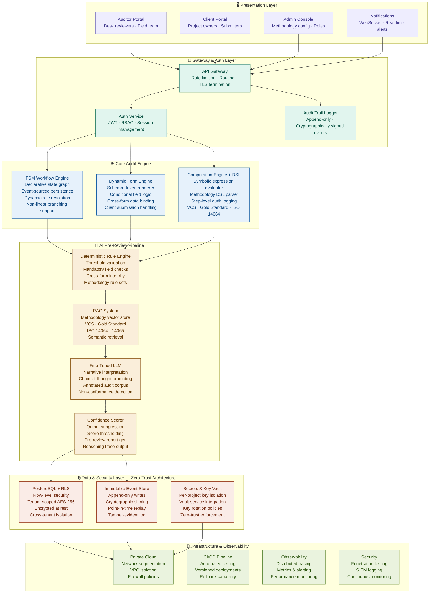

# Earthlink — Intelligent Audit Workplace

**Built by Earthood | Redefining Validation & Verification through Technology**

Earthood is a premier **Validation and Verification Body (VVB)** dedicated to delivering high-integrity assessments for carbon projects, climate initiatives, and ESG assurance. As we push the boundaries of what’s possible in MRV (Monitoring, Reporting, and Verification), we are proud to introduce **Earthlink** our flagship digital platform that transforms traditional audit workflows into a seamless, intelligent, and highly efficient ecosystem.

Earthlink is not just another audit tool. It is a complete **audit workplace** designed from the ground up to eliminate manual inefficiencies, accelerate delivery timelines, enhance collaboration, and significantly elevate the quality and defensibility of every verification and validation engagement.

---

## Our Vision

In today’s audit landscape, critical processes still rely on fragmented emails, manual spreadsheets, physical documents, and repetitive back-and-forth cycles. This leads to prolonged timelines, increased risk of errors, version control challenges, and limited visibility for all stakeholders.

Earthlink changes this paradigm entirely.

It provides a **single, unified, and auditable digital workspace** where the entire audit lifecycle, from project intake and data collection to technical review, quality assurance, and final report issuance — is orchestrated with precision. Every team member, client, and external stakeholder operates within a transparent, real-time, and secure environment that ensures nothing falls through the cracks.

---

## Key Capabilities

### 1. End-to-End Workflow Management
Earthlink offers comprehensive workflow orchestration that covers the full spectrum of audit activities. With intelligent task routing, automated notifications, dependency mapping, and real-time progress tracking, teams gain complete visibility and control over every project.

- Seamless collaboration between internal auditors, technical experts, project developers, and clients
- Granular role-based access control (RBAC) with detailed permission matrices
- Immutable audit trails and full historical traceability for regulatory compliance and future reference
- Centralized repository for all project artifacts, communications, and decisions

### 2. Digitized Forms with Advanced Calculation Engine
We are going to fully digitized all relevant VVB forms, questionnaires, and supporting documentation. Behind these forms lies a powerful **computation layer** powered by highly optimized, battle-tested algorithms.

Complex calculations including baseline emissions, project emissions, leakage, additionality assessments, uncertainty analysis, and methodology-specific formulas will be executed instantly with mathematical precision and full reproducibility. This eliminates hours of manual spreadsheet work while maintaining complete transparency and auditability.

### 3. AI-Powered Intelligence Layer
The true differentiator of Earthlink is its deeply integrated artificial intelligence capability.

As soon as a client submits data or completed forms, our multi-layered intelligence engine activates:
- **Rule-based algorithmic validation**
- **Large Language Models (LLMs)** for contextual understanding and natural language reasoning
- **Custom-trained models** for domain-specific anomaly detection

This will result in an **instant pre-review report** that highlights inconsistencies, methodological deviations, calculation errors, data quality issues, and missing evidence complete with severity ratings and actionable recommendations.

Reviewers no longer waste time on repetitive calculations or basic error hunting. Instead, they receive clean, pre-vetted submissions and can focus their expertise on high-value judgment, risk assessment, and strategic insights. The outcome is dramatically reduced cycle times, significantly higher throughput, and consistently superior audit quality.

### 4. Enterprise-Grade Security & Data Protection
At Earthood, we treat client and project data with the utmost seriousness. Earthlink is built on a **zero-trust security model** with end-to-end encryption for data at rest and in transit. 

We implement strict tenant isolation, column-level encryption, comprehensive audit logging, and continuous security monitoring. All systems are designed to exceed the stringent requirements of VVB accreditation bodies while aligning with global standards.

Our clients can rest assured that their sensitive project information remains fully protected, confidential, and compliant at every step.

---

## System Architecture

Earthlink is engineered as a modern, scalable, cloud-native platform using microservices architecture, ensuring high availability, performance, and future extensibility.

**High-Level Architecture (Draft)**

> 

### Core Technical Components
- **Backend Services**: Hybrid stack leveraging NestJS (TypeScript) for robust workflow management and FastAPI (Python) for high-performance computation and AI workloads.
- **Database Layer**: PostgreSQL with TimescaleDB extension for time-series audit logs and JSONB support for flexible, schema-evolving forms.
- **Workflow Orchestration**: Reliable, durable execution of long-running business processes with built-in support for human-in-the-loop interactions.
- **AI & Intelligence Layer**: Sophisticated orchestration combining LLMs, Retrieval-Augmented Generation (RAG), and custom algorithms.

**AI & RAG Architecture (Draft)**

```mermaid 
flowchart TD

    %% ─────────────────────────────────────
    %% CLIENT
    %% ─────────────────────────────────────
    subgraph CLIENT["🖥️  Client — React SPA"]
        UI1["Auditor Workspace\nReact · TypeScript"]
        UI2["Client Submission Portal\nReact · TypeScript"]
        UI3["Admin Console\nReact · TypeScript"]
        WS["WebSocket Client\nReal-time collaboration\nPresence & notifications"]
    end

    %% ─────────────────────────────────────
    %% CDN & EDGE
    %% ─────────────────────────────────────
    CDN["AWS CloudFront CDN\nStatic asset delivery · Edge caching"]

    %% ─────────────────────────────────────
    %% API GATEWAY
    %% ─────────────────────────────────────
    subgraph GATEWAY["🔐  API Gateway & Auth — AWS API Gateway + ALB"]
        GW["API Gateway\nTLS termination · Rate limiting\nRequest routing · CORS"]
        AUTH["Auth Service — Node.js\nJWT issuance & validation\nRBAC · Session management\nRefresh token rotation"]
        WSGATE["WebSocket Gateway\nAWS API Gateway WebSocket\nConnection registry"]
    end

    %% ─────────────────────────────────────
    %% CORE SERVICES — NODE.JS
    %% ─────────────────────────────────────
    subgraph NODESVCS["⚙️  Core Services — Node.js / Express"]
        WF["Workflow Service\nFSM engine · State graph executor\nEvent emitter · Role resolver\nOptimistic locking"]
        FORM["Form Service\nSchema registry · Field renderer API\nConditional logic evaluator\nSubmission handler"]
        PROJ["Project Service\nProject lifecycle management\nTeam & assignment management\nDocument orchestration"]
        NOTIF["Notification Service\nWebSocket push · Email triggers\nEvent-driven alerts\nActivity feed"]
    end

    %% ─────────────────────────────────────
    %% COMPUTATION SERVICE — PYTHON
    %% ─────────────────────────────────────
    subgraph PYSVCS["🧮  Computation Service — Python / FastAPI"]
        CALC["Computation Engine\nSymbolic expression evaluator\nDSL parser & interpreter\nIntermediate step logger\nPrecision arithmetic — decimal.js"]
        DSL["Methodology DSL\nRule authoring interface\nVCS · Gold Standard · CDM\nISO 14064 rule sets\nVersion-controlled rule store"]
    end

    %% ─────────────────────────────────────
    %% AI PIPELINE — PYTHON
    %% ─────────────────────────────────────
    subgraph AIPIPE["🤖  AI Pre-Review Pipeline — Python / FastAPI"]
        RULES["Deterministic Rule Engine\nThreshold validation\nMandatory field checks\nCross-form integrity\nMethodology rule sets"]
        RAG["RAG Service\nLangChain orchestration\nFAISS vector store\nChunk retrieval · Re-ranking\nMethodology doc indexing"]
        LLM["LLM Inference Service\nSelf-hosted open source LLM\nvLLM serving engine\nFine-tuned on audit corpus\nChain-of-thought prompting"]
        SCORE["Confidence Scorer\nScore thresholding\nOutput suppression\nPre-review report builder\nReasoning trace formatter"]
        RULES --> RAG --> LLM --> SCORE
    end

    %% ─────────────────────────────────────
    %% MESSAGE QUEUE
    %% ─────────────────────────────────────
    subgraph QUEUE["📨  Async Messaging — AWS SQS + SNS"]
        SQS1["Submission Queue\nForm submission events\nAI pipeline trigger"]
        SQS2["Notification Queue\nEmail · WebSocket dispatch"]
        SQS3["Audit Log Queue\nEvent persistence\nAsync write buffer"]
    end

    %% ─────────────────────────────────────
    %% DATA LAYER
    %% ─────────────────────────────────────
    subgraph DATA["🗄️  Data Layer"]
        PG["PostgreSQL — AWS RDS\nRow-level security\nTenant-scoped AES-256\nMulti-AZ · Encrypted at rest\nPoint-in-time recovery"]
        EVSTORE["Event Store — PostgreSQL\nAppend-only writes\nCryptographic signing\nImmutable audit trail\nPoint-in-time replay"]
        REDIS["Redis — AWS ElastiCache\nSession store\nForm draft caching\nWebSocket state\nRate limit counters"]
        S3["AWS S3\nDocument & file storage\nEncrypted · Versioned\nPresigned URL access\nProject artefact store"]
        VECTOR["FAISS Vector Store\nMethodology embeddings\nChunk index\nSemantic search\nHosted on EC2"]
    end

    %% ─────────────────────────────────────
    %% AI MODEL STORAGE
    %% ─────────────────────────────────────
    subgraph MODELS["🧠  Model Registry — AWS S3 + EC2"]
        FTMODEL["Fine-Tuned LLM Weights\nBase — open source LLM\nFine-tuned on audit corpus\nVersioned checkpoints"]
        EMBED["Embedding Model\nDomain-tuned encoder\nMethodology doc embeddings\nFAISS index builder"]
    end

    %% ─────────────────────────────────────
    %% SECURITY & KEY MANAGEMENT
    %% ─────────────────────────────────────
    subgraph SECURITY["🔒  Security — Zero-Trust"]
        KMS["AWS KMS\nPer-project encryption keys\nKey rotation policies\nEnvelope encryption"]
        SECRET["AWS Secrets Manager\nDB credentials\nAPI keys · Service secrets\nAutomatic rotation"]
        WAF["AWS WAF\nDDoS protection\nIP allowlisting\nRequest inspection"]
    end

    %% ─────────────────────────────────────
    %% OBSERVABILITY
    %% ─────────────────────────────────────
    subgraph OBS["📊  Observability — AWS Native"]
        CW["CloudWatch\nMetrics · Logs · Alarms\nLambda & ECS monitoring"]
        TRACE["AWS X-Ray\nDistributed tracing\nLatency profiling\nService map"]
        SIEM["SIEM — CloudWatch Logs\nSecurity event aggregation\nAnomaly detection alerts"]
    end

    %% ─────────────────────────────────────
    %% COMPUTE
    %% ─────────────────────────────────────
    subgraph COMPUTE["🏗️  Compute — AWS"]
        ECS["AWS ECS — Fargate\nNode.js services\nAuto-scaling · Load balanced"]
        EC2GPU["EC2 GPU Instances\nLLM inference — vLLM\nEmbedding generation\nFine-tuning workloads"]
        LAMBDA["AWS Lambda\nEvent-driven triggers\nQueue consumers\nScheduled jobs"]
    end

    %% ─────────────────────────────────────
    %% FLOW CONNECTIONS
    %% ─────────────────────────────────────

    CLIENT --> CDN --> GW
    UI1 & UI2 & UI3 --> GW
    WS --> WSGATE

    GW --> AUTH
    GW --> WF & FORM & PROJ
    WSGATE --> NOTIF

    WF --> SQS3
    FORM --> SQS1
    FORM --> CALC
    PROJ --> PG

    SQS1 --> RULES
    SCORE --> SQS2
    SQS2 --> NOTIF
    SQS3 --> EVSTORE

    CALC --> DSL
    CALC --> PG
    CALC --> EVSTORE

    RAG --> VECTOR
    LLM --> FTMODEL
    EMBED --> VECTOR

    RULES & SCORE --> PG
    SCORE --> S3

    WF & FORM & PROJ & NOTIF --> PG
    WF & FORM --> REDIS
    PROJ --> S3

    PG & EVSTORE --> KMS
    S3 --> KMS
    SECRET --> WF & FORM & CALC & LLM

    WAF --> GW

    ECS -.->|hosts| WF & FORM & PROJ & NOTIF & AUTH
    EC2GPU -.->|hosts| LLM & EMBED & FTMODEL
    LAMBDA -.->|consumes| SQS1 & SQS2 & SQS3

    CW -.->|monitors| ECS & EC2GPU & LAMBDA
    TRACE -.->|traces| GW & WF & AIPIPE
    SIEM -.->|aggregates| CW

    %% ─────────────────────────────────────
    %% STYLES
    %% ─────────────────────────────────────
    classDef client      fill:#EEEDFE,stroke:#534AB7,color:#3C3489
    classDef gateway     fill:#E1F5EE,stroke:#0F6E56,color:#085041
    classDef nodesvcs    fill:#E6F1FB,stroke:#185FA5,color:#0C447C
    classDef pysvcs      fill:#EAF3DE,stroke:#3B6D11,color:#27500A
    classDef ai          fill:#FAEEDA,stroke:#854F0B,color:#633806
    classDef queue       fill:#FBEAF0,stroke:#993556,color:#72243E
    classDef data        fill:#FAECE7,stroke:#993C1D,color:#712B13
    classDef models      fill:#F1EFE8,stroke:#5F5E5A,color:#2C2C2A
    classDef security    fill:#FCEBEB,stroke:#A32D2D,color:#501313
    classDef obs         fill:#E1F5EE,stroke:#0F6E56,color:#085041
    classDef compute     fill:#E6F1FB,stroke:#185FA5,color:#0C447C
    classDef cdn         fill:#F1EFE8,stroke:#5F5E5A,color:#444441

    class UI1,UI2,UI3,WS client
    class GW,AUTH,WSGATE gateway
    class WF,FORM,PROJ,NOTIF nodesvcs
    class CALC,DSL pysvcs
    class RULES,RAG,LLM,SCORE ai
    class SQS1,SQS2,SQS3 queue
    class PG,EVSTORE,REDIS,S3,VECTOR data
    class FTMODEL,EMBED models
    class KMS,SECRET,WAF security
    class CW,TRACE,SIEM obs
    class ECS,EC2GPU,LAMBDA compute
    class CDN cdn
```

**Database Schema & Structure (Draft)**

```mermaid
erDiagram

    %% =============================================
    %% 1. PROJECTS & PROPOSALS
    %% =============================================
    subgraph PROJECTS["📁 Projects & Proposals"]
        projects {
            int id PK
            string earthood_id
            int program_id FK
            string project_name
            int client_id FK
            int consultant_id FK
            int contact_person_id FK
            string status
            string project_status
        }

        project_proposals {
            int id PK
            int program_id FK
            string project_name
            int client_id FK
            int consultant_id FK
            date proposal_date
            float implemented_fees
            string payment_terms
            int deal_lost_reason_id FK
        }

        project_activity_log {
            int id PK
            int project_id FK
            string activity
            int created_by FK
            datetime created_at
        }

        project_notes {
            int id PK
            int project_id FK
            string note
            int created_by FK
        }

        project_evidences {
            int id PK
            int project_id FK
            string file_path
            int uploaded_by FK
        }
    end

    %% =============================================
    %% 2. USERS & CLIENTS
    %% =============================================
    subgraph USERS_CLIENTS["👥 Users & Clients"]
        users {
            int id PK
            string name
            string email
            int role_id FK
            int designation_id FK
            string user_type
            string status
        }

        clients {
            int id PK
            string name
            string email
            int country_id FK
            string contact_person
            string status
        }

        roles {
            int id PK
            string name
        }

        designations {
            int id PK
            string name
        }
    end

    %% =============================================
    %% 3. TEAM & TIMESHEET
    %% =============================================
    subgraph TEAM_TIMESHEET["👷 Team & Timesheet"]
        project_assessment_team {
            int id PK
            int project_id FK
            int user_id FK
            int role_id FK
        }

        team_change_logs {
            int id PK
            int project_id FK
            int old_user_id FK
            int new_user_id FK
            int changed_by FK
            datetime changed_at
        }

        timesheet_users_data {
            int id PK
            int project_id FK
            int task_id FK
            int role_id FK
            date start_date
            date end_date
            float total_consumed_time
        }

        timesheet_tasks {
            int id PK
            string name
        }

        timesheet_roles {
            int id PK
            string name
        }

        timesheet_task_role_mapping {
            int id PK
            int task_id FK
            int role_id FK
            string time_formula
            float computed_time
        }
    end

    %% =============================================
    %% 4. AUDIT & KICKOUT
    %% =============================================
    subgraph AUDIT["🔍 Audit & Kickout"]
        audit_plans {
            int id PK
            int project_id FK
            int user_id FK
            string audit_plan
            string remarks
        }

        kickout_rounds {
            int id PK
            int project_id FK
            string round_type
            string pdd_document
            string irr_document
            string registrar_status
            string sbu_status
            string tl_status
            string client_status
            string cc_status
            string remarks
        }

        kickout_attachments {
            int id PK
            int kickout_id FK
            string file_path
        }
    end

    %% =============================================
    %% 5. MASTER DATA
    %% =============================================
    subgraph MASTER["📋 Master Data"]
        countries {
            int id PK
            string name
        }

        regions {
            int id PK
            int country_id FK
            string name
        }

        programs {
            int id PK
            string name
        }

        deal_lost_reasons {
            int id PK
            string reason
        }
    end

    %% =============================================
    %% 6. RAG + AI LAYER (New)
    %% =============================================
    subgraph AI_RAG["🤖 RAG & AI Pre-Review Layer"]
        methodology_documents {
            int id PK
            string document_type
            string version
            string file_path
            datetime uploaded_at
            string status
        }

        vector_chunks {
            int id PK
            int document_id FK
            string chunk_text
            vector embedding
            string metadata
        }

        rag_retrieval_logs {
            int id PK
            int project_id FK
            int query_service_id FK
            string query_text
            int retrieved_chunk_count
            datetime queried_at
        }

        ai_audit_results {
            int id PK
            int project_id FK
            int kickout_round_id FK
            string llm_model
            string non_conformance_findings
            float confidence_score
            string reasoning_trace
            datetime generated_at
        }
    end

    %% =============================================
    %% RELATIONSHIPS
    %% =============================================

    %% Projects core relationships
    projects ||--o{ project_activity_log : "has"
    projects ||--o{ project_notes : "has"
    projects ||--o{ project_evidences : "has"
    projects ||--o{ project_assessment_team : "has"
    projects ||--o{ timesheet_users_data : "has"
    projects ||--o{ audit_plans : "has"
    projects ||--o{ kickout_rounds : "has"
    projects }o--|| clients : "belongs_to"
    projects }o--|| programs : "belongs_to"

    project_proposals }o--|| clients : "belongs_to"
    project_proposals }o--|| programs : "belongs_to"
    project_proposals }o--|| deal_lost_reasons : "has"

    %% Team & Users
    project_assessment_team }o--|| users : "assigned"
    project_assessment_team }o--|| roles : "has_role"
    team_change_logs }o--|| projects : "belongs_to"
    team_change_logs }o--|| users : "old_user"
    team_change_logs }o--|| users : "new_user"

    users }o--|| roles : "has"
    users }o--|| designations : "has"

    %% Timesheet
    timesheet_users_data }o--|| timesheet_tasks : "task"
    timesheet_users_data }o--|| timesheet_roles : "role"
    timesheet_task_role_mapping }o--|| timesheet_tasks : "task"
    timesheet_task_role_mapping }o--|| timesheet_roles : "role"

    %% Audit & Kickout
    audit_plans }o--|| users : "created_by"
    kickout_attachments }o--|| kickout_rounds : "belongs_to"

    %% Master Data
    clients }o--|| countries : "belongs_to"
    countries ||--o{ regions : "has"

    %% New AI/RAG Relationships
    projects ||--o{ rag_retrieval_logs : "uses"
    projects ||--o{ ai_audit_results : "has_ai_review"
    kickout_rounds ||--o{ ai_audit_results : "linked_to"
    methodology_documents ||--o{ vector_chunks : "split_into"
    vector_chunks }o--|| rag_retrieval_logs : "retrieved_in"

```

Our RAG implementation features hybrid retrieval strategies, advanced metadata filtering, and multi-stage re-ranking to ensure highly relevant and accurate context retrieval from our extensive knowledge base of methodologies, past audits, and regulatory documents. Guardrails and structured output enforcement minimize hallucinations while maintaining domain precision.

---
 
## Technology Stack

Earthlink is engineered on a robust, modern, and future-proof technology stack optimized for high-throughput audit workflows, complex calculations, secure data handling, and advanced AI integration.

| Layer                          | Technology |
|--------------------------------|----------|
| **Frontend**                   | Next.js 15 (App Router), TypeScript, Tailwind CSS, shadcn/ui |
| **Backend**                    | FastAPI — High-performance Python web framework, NestJS |
| **Database**                   | PostgreSQL + TimescaleDB, Neo4j / ArangoDB (Graph Database), Qdrant (Vector similarity search engine) |
| **AI & LLM Orchestration**     | LangChain, LangGraph — State graphs for complex LLM agentic workflows, Multi-model orchestration |
| **Event Streaming & Messaging**| Apache Kafka — Distributed event streaming platform, Redis — In-memory caching, messaging & pub/sub |
| **Task & Workflow Management** | Celery — Distributed task queue system |
| **Document Intelligence**      | Docling — Advanced document parsing and extraction toolkit, PyMuPDF, OCRmyPDF |
| **Data Processing**            | pandas — High-performance data analysis and manipulation |
| **Configuration Store**        | etcd3 — Distributed key-value configuration store |
| **Infrastructure & Orchestration** | Kubernetes, Docker, Terraform |
| **Observability**              | OpenTelemetry, Prometheus, Grafana, ELK Stack |
| **Security**                   | Zero-trust architecture, OAuth2/OIDC, Column-level encryption |

---

## Transformative Impact

By combining digitized workflows, algorithmic precision, and intelligent AI assistance, Earthlink delivers measurable advantages:

- **Substantial time savings** — reducing manual review effort by 60–80% in typical engagements
- **Higher audit throughput** without compromising quality
- **Elevated consistency and defensibility** of findings
- **Superior client experience** through real-time visibility and rapid feedback loops
- **Future-ready platform** that continuously evolves with emerging standards and technologies

Earthlink positions Earthood as the most technologically advanced and operationally efficient VVB in the market — setting a new benchmark for what high-integrity verification can achieve.

---

## Security & Compliance

Security is not an afterthought at Earthlink — it is a core engineering principle. The platform incorporates defense-in-depth controls, regular third-party security assessments, and continuous compliance validation to meet the highest standards expected from a leading Validation and Verification Body.

---

## Roadmap

- **Current**: Core workflow engine
- **Near-term**: Digitized forms, algorithmic calculations, initial AI pre-check capabilities, Advanced RAG-powered insights, automated report generation, and predictive risk analytics
- **Future**: Agentic AI workflows and deeper integration across global carbon market standards

---

**Earthlink** — Where precision meets intelligence.  
Where audits become faster, smarter, and undeniably more robust.

*Built by Earthood with a relentless focus on quality, security, and innovation.*

