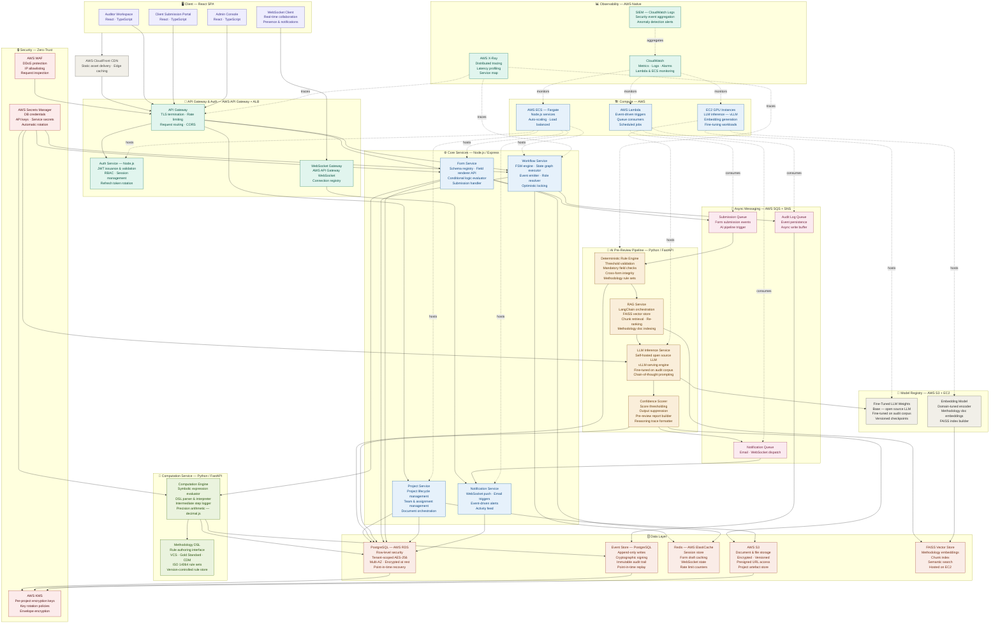
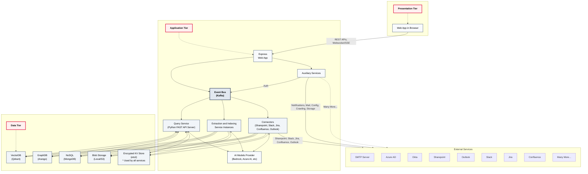

New Draft architectural flow.

```mermaid 
flowchart TD

    %% ─────────────────────────────────────
    %% CLIENT
    %% ─────────────────────────────────────
    subgraph CLIENT["🖥️  Client — React SPA"]
        UI1["Auditor Workspace\nReact · TypeScript"]
        UI2["Client Submission Portal\nReact · TypeScript"]
        UI3["Admin Console\nReact · TypeScript"]
        WS["WebSocket Client\nReal-time collaboration\nPresence & notifications"]
    end

    %% ─────────────────────────────────────
    %% CDN & EDGE
    %% ─────────────────────────────────────
    CDN["AWS CloudFront CDN\nStatic asset delivery · Edge caching"]

    %% ─────────────────────────────────────
    %% API GATEWAY
    %% ─────────────────────────────────────
    subgraph GATEWAY["🔐  API Gateway & Auth — AWS API Gateway + ALB"]
        GW["API Gateway\nTLS termination · Rate limiting\nRequest routing · CORS"]
        AUTH["Auth Service — Node.js\nJWT issuance & validation\nRBAC · Session management\nRefresh token rotation"]
        WSGATE["WebSocket Gateway\nAWS API Gateway WebSocket\nConnection registry"]
    end

    %% ─────────────────────────────────────
    %% CORE SERVICES — NODE.JS
    %% ─────────────────────────────────────
    subgraph NODESVCS["⚙️  Core Services — Node.js / Express"]
        WF["Workflow Service\nFSM engine · State graph executor\nEvent emitter · Role resolver\nOptimistic locking"]
        FORM["Form Service\nSchema registry · Field renderer API\nConditional logic evaluator\nSubmission handler"]
        PROJ["Project Service\nProject lifecycle management\nTeam & assignment management\nDocument orchestration"]
        NOTIF["Notification Service\nWebSocket push · Email triggers\nEvent-driven alerts\nActivity feed"]
    end

    %% ─────────────────────────────────────
    %% COMPUTATION SERVICE — PYTHON
    %% ─────────────────────────────────────
    subgraph PYSVCS["🧮  Computation Service — Python / FastAPI"]
        CALC["Computation Engine\nSymbolic expression evaluator\nDSL parser & interpreter\nIntermediate step logger\nPrecision arithmetic — decimal.js"]
        DSL["Methodology DSL\nRule authoring interface\nVCS · Gold Standard · CDM\nISO 14064 rule sets\nVersion-controlled rule store"]
    end

    %% ─────────────────────────────────────
    %% AI PIPELINE — PYTHON
    %% ─────────────────────────────────────
    subgraph AIPIPE["🤖  AI Pre-Review Pipeline — Python / FastAPI"]
        RULES["Deterministic Rule Engine\nThreshold validation\nMandatory field checks\nCross-form integrity\nMethodology rule sets"]
        RAG["RAG Service\nLangChain orchestration\nFAISS vector store\nChunk retrieval · Re-ranking\nMethodology doc indexing"]
        LLM["LLM Inference Service\nSelf-hosted open source LLM\nvLLM serving engine\nFine-tuned on audit corpus\nChain-of-thought prompting"]
        SCORE["Confidence Scorer\nScore thresholding\nOutput suppression\nPre-review report builder\nReasoning trace formatter"]
        RULES --> RAG --> LLM --> SCORE
    end

    %% ─────────────────────────────────────
    %% MESSAGE QUEUE
    %% ─────────────────────────────────────
    subgraph QUEUE["📨  Async Messaging — AWS SQS + SNS"]
        SQS1["Submission Queue\nForm submission events\nAI pipeline trigger"]
        SQS2["Notification Queue\nEmail · WebSocket dispatch"]
        SQS3["Audit Log Queue\nEvent persistence\nAsync write buffer"]
    end

    %% ─────────────────────────────────────
    %% DATA LAYER
    %% ─────────────────────────────────────
    subgraph DATA["🗄️  Data Layer"]
        PG["PostgreSQL — AWS RDS\nRow-level security\nTenant-scoped AES-256\nMulti-AZ · Encrypted at rest\nPoint-in-time recovery"]
        EVSTORE["Event Store — PostgreSQL\nAppend-only writes\nCryptographic signing\nImmutable audit trail\nPoint-in-time replay"]
        REDIS["Redis — AWS ElastiCache\nSession store\nForm draft caching\nWebSocket state\nRate limit counters"]
        S3["AWS S3\nDocument & file storage\nEncrypted · Versioned\nPresigned URL access\nProject artefact store"]
        VECTOR["FAISS Vector Store\nMethodology embeddings\nChunk index\nSemantic search\nHosted on EC2"]
    end

    %% ─────────────────────────────────────
    %% AI MODEL STORAGE
    %% ─────────────────────────────────────
    subgraph MODELS["🧠  Model Registry — AWS S3 + EC2"]
        FTMODEL["Fine-Tuned LLM Weights\nBase — open source LLM\nFine-tuned on audit corpus\nVersioned checkpoints"]
        EMBED["Embedding Model\nDomain-tuned encoder\nMethodology doc embeddings\nFAISS index builder"]
    end

    %% ─────────────────────────────────────
    %% SECURITY & KEY MANAGEMENT
    %% ─────────────────────────────────────
    subgraph SECURITY["🔒  Security — Zero-Trust"]
        KMS["AWS KMS\nPer-project encryption keys\nKey rotation policies\nEnvelope encryption"]
        SECRET["AWS Secrets Manager\nDB credentials\nAPI keys · Service secrets\nAutomatic rotation"]
        WAF["AWS WAF\nDDoS protection\nIP allowlisting\nRequest inspection"]
    end

    %% ─────────────────────────────────────
    %% OBSERVABILITY
    %% ─────────────────────────────────────
    subgraph OBS["📊  Observability — AWS Native"]
        CW["CloudWatch\nMetrics · Logs · Alarms\nLambda & ECS monitoring"]
        TRACE["AWS X-Ray\nDistributed tracing\nLatency profiling\nService map"]
        SIEM["SIEM — CloudWatch Logs\nSecurity event aggregation\nAnomaly detection alerts"]
    end

    %% ─────────────────────────────────────
    %% COMPUTE
    %% ─────────────────────────────────────
    subgraph COMPUTE["🏗️  Compute — AWS"]
        ECS["AWS ECS — Fargate\nNode.js services\nAuto-scaling · Load balanced"]
        EC2GPU["EC2 GPU Instances\nLLM inference — vLLM\nEmbedding generation\nFine-tuning workloads"]
        LAMBDA["AWS Lambda\nEvent-driven triggers\nQueue consumers\nScheduled jobs"]
    end

    %% ─────────────────────────────────────
    %% FLOW CONNECTIONS
    %% ─────────────────────────────────────

    CLIENT --> CDN --> GW
    UI1 & UI2 & UI3 --> GW
    WS --> WSGATE

    GW --> AUTH
    GW --> WF & FORM & PROJ
    WSGATE --> NOTIF

    WF --> SQS3
    FORM --> SQS1
    FORM --> CALC
    PROJ --> PG

    SQS1 --> RULES
    SCORE --> SQS2
    SQS2 --> NOTIF
    SQS3 --> EVSTORE

    CALC --> DSL
    CALC --> PG
    CALC --> EVSTORE

    RAG --> VECTOR
    LLM --> FTMODEL
    EMBED --> VECTOR

    RULES & SCORE --> PG
    SCORE --> S3

    WF & FORM & PROJ & NOTIF --> PG
    WF & FORM --> REDIS
    PROJ --> S3

    PG & EVSTORE --> KMS
    S3 --> KMS
    SECRET --> WF & FORM & CALC & LLM

    WAF --> GW

    ECS -.->|hosts| WF & FORM & PROJ & NOTIF & AUTH
    EC2GPU -.->|hosts| LLM & EMBED & FTMODEL
    LAMBDA -.->|consumes| SQS1 & SQS2 & SQS3

    CW -.->|monitors| ECS & EC2GPU & LAMBDA
    TRACE -.->|traces| GW & WF & AIPIPE
    SIEM -.->|aggregates| CW

    %% ─────────────────────────────────────
    %% STYLES
    %% ─────────────────────────────────────
    classDef client      fill:#EEEDFE,stroke:#534AB7,color:#3C3489
    classDef gateway     fill:#E1F5EE,stroke:#0F6E56,color:#085041
    classDef nodesvcs    fill:#E6F1FB,stroke:#185FA5,color:#0C447C
    classDef pysvcs      fill:#EAF3DE,stroke:#3B6D11,color:#27500A
    classDef ai          fill:#FAEEDA,stroke:#854F0B,color:#633806
    classDef queue       fill:#FBEAF0,stroke:#993556,color:#72243E
    classDef data        fill:#FAECE7,stroke:#993C1D,color:#712B13
    classDef models      fill:#F1EFE8,stroke:#5F5E5A,color:#2C2C2A
    classDef security    fill:#FCEBEB,stroke:#A32D2D,color:#501313
    classDef obs         fill:#E1F5EE,stroke:#0F6E56,color:#085041
    classDef compute     fill:#E6F1FB,stroke:#185FA5,color:#0C447C
    classDef cdn         fill:#F1EFE8,stroke:#5F5E5A,color:#444441

    class UI1,UI2,UI3,WS client
    class GW,AUTH,WSGATE gateway
    class WF,FORM,PROJ,NOTIF nodesvcs
    class CALC,DSL pysvcs
    class RULES,RAG,LLM,SCORE ai
    class SQS1,SQS2,SQS3 queue
    class PG,EVSTORE,REDIS,S3,VECTOR data
    class FTMODEL,EMBED models
    class KMS,SECRET,WAF security
    class CW,TRACE,SIEM obs
    class ECS,EC2GPU,LAMBDA compute
    class CDN cdn
```

New RAG Pipeline:

```mermaid
flowchart TB
    %% Tiers
    subgraph Presentation[" "]
        direction TB
        PresentationTier["Presentation Tier"]:::tier
        WebAppBrowser["Web App in Browser"]:::box
    end

    subgraph Application[" "]
        direction TB
        ApplicationTier["Application Tier"]:::tier
        AI["AI Models Provider<br/>(Bedrock, Azure AI, etc)"]:::ai
        Express["Express<br/>Web App"]:::box
        EventBus["Event Bus<br/>(Kafka)"]:::bus
        QueryService["Query Service<br/>(Python FAST API Server)"]:::service
        Extraction["Extraction and Indexing<br/>Service Instances"]:::service
        Connectors["Connectors<br/>(Sharepoint, Slack, Jira, Confluence, Outlook)"]:::service
        Aux["Auxiliary Services"]:::aux
    end

    subgraph Data[" "]
        direction TB
        DataTier["Data Tier"]:::tier
        VectorDB["VectorDB<br/>(Qdrant)"]:::db
        GraphDB["GraphDB<br/>(Arango)"]:::db
        NoSQL["NoSQL<br/>(MongoDB)"]:::db
        Blob["Blob Storage<br/>(Local/S3)"]:::db
        KV["Encrypted KV Store<br/>(etcd)<br/>* Used by all services"]:::db
    end

    %% External services (right side)
    subgraph External["External Services"]
        direction TB
        SMTP["SMTP Server"]
        AzureAD["Azure AD"]
        Okta["Okta"]
        Sharepoint["Sharepoint"]
        Outlook["Outlook"]
        Slack["Slack"]
        Jira["Jira"]
        Confluence["Confluence"]
        ManyMore["Many More..."]
    end

    %% Connections

    %% Presentation to Application
    WebAppBrowser -->|"REST APIs, Websocket/SSE"| Express

    %% Application internal flow
    Express -->| | EventBus
    EventBus --> QueryService
    EventBus --> Extraction
    EventBus --> Connectors

    QueryService <-->| | VectorDB
    QueryService <-->| | GraphDB
    QueryService <-->| | NoSQL
    QueryService <-->| | Blob
    QueryService <-->| | KV

    Extraction -->| | VectorDB
    Extraction -->| | GraphDB
    Extraction -->| | NoSQL
    Extraction -->| | Blob
    Extraction -->| | KV

    Connectors -->| | VectorDB
    Connectors -->| | GraphDB
    Connectors -->| | NoSQL
    Connectors -->| | Blob
    Connectors -->| | KV

    %% AI Models
    QueryService <-->| | AI
    Extraction <-->| | AI
    Connectors <-->| | AI

    %% Auxiliary Services
    Express --> Aux
    Aux -->|"Auth"| EventBus

    %% External integrations
    Aux -->|"Notifications, Mail, Config, Crawling, Storage"| External
    Connectors -->|"Sharepoint, Slack, Jira, Confluence, Outlook"| External
    Aux -.->|"Many More..."| External

    %% Tier labels (positioned on left)
    PresentationTier -.-> WebAppBrowser
    ApplicationTier -.-> Express
    DataTier -.-> VectorDB

    %% Styling
    classDef tier fill:#fff0f0,stroke:#e11d48,stroke-width:3px,color:#000,font-weight:bold
    classDef box fill:#f8fafc,stroke:#64748b,stroke-width:2px,color:#000
    classDef bus fill:#e2e8f0,stroke:#475569,stroke-width:3px,color:#000,font-weight:bold
    classDef service fill:#f1f5f9,stroke:#64748b,stroke-width:2px,color:#000
    classDef ai fill:#f8fafc,stroke:#64748b,stroke-width:2px,color:#000
    classDef aux fill:#f8fafc,stroke:#64748b,stroke-width:2px,color:#000
    classDef db fill:#f1f5f9,stroke:#64748b,stroke-width:2px,color:#000
```
